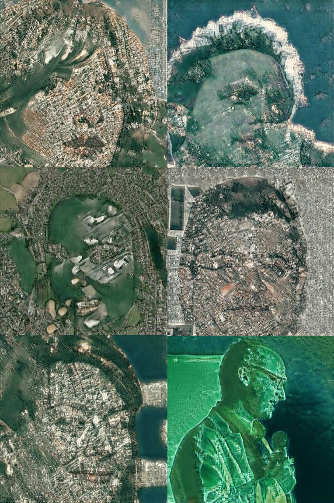
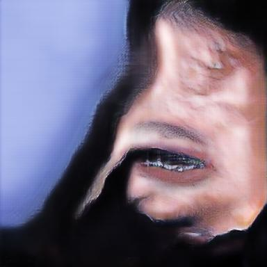

<!--  

   
-->
# CycleGAN

Tensorflow implementation for learning an image-to-image translation **without** input-output pairs.
The method is proposed by [Jun-Yan Zhu](https://people.eecs.berkeley.edu/~junyanz/) in 
[Unpaired Image-to-Image Translation using Cycle-Consistent Adversarial Networkssee](https://arxiv.org/pdf/1703.10593.pdf). 

# This is modified code for human<->map

Every human face is unique and complicated, so as every city.

Faces database - custom big face crops from celebA, map databases - cities with population >10k on Google Maps.

Changes added by Sergei to original code and model - skip-connection, low L1 (cycle loss), bug fixing, depth2space instead of deconv.

## Map of Vladivostok 

